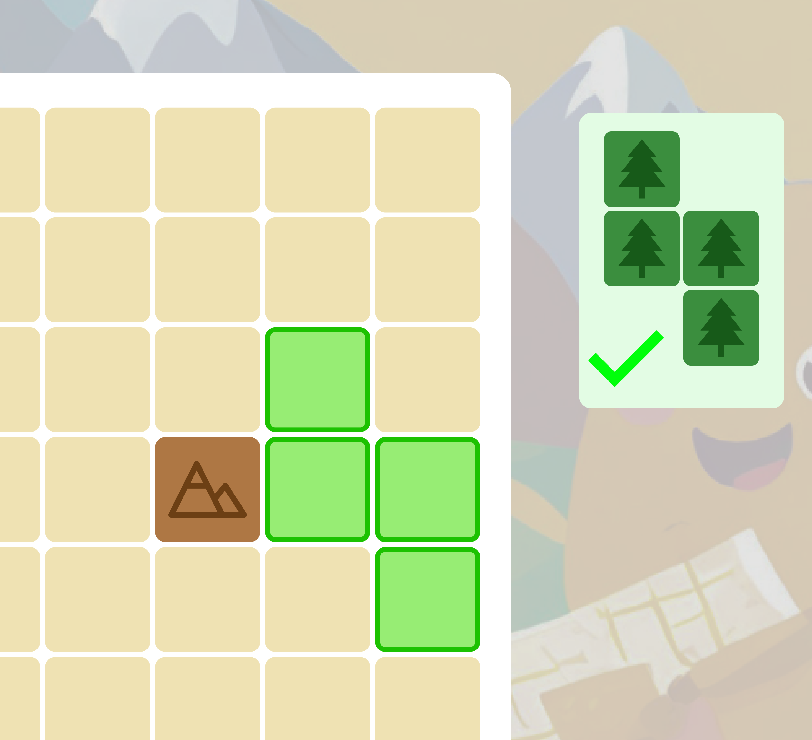
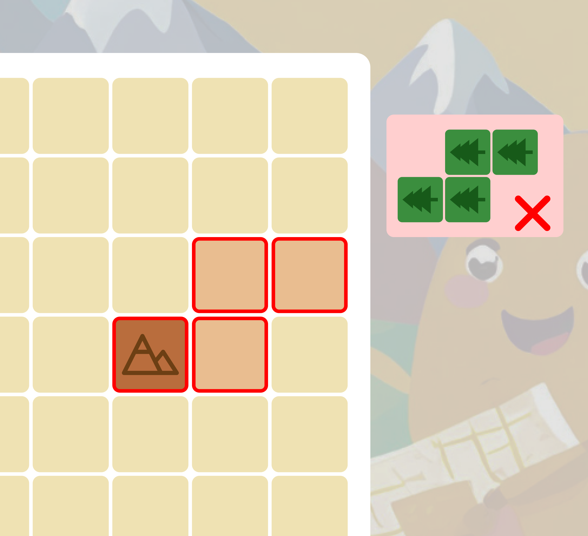

# Potato Empire Mapmaker

## Overview

Embark on an imperial mapping adventure as the appointed mapmaker in the Potato Empire. Empress French Frie has entrusted you with the task of exploring and settling uncharted territories. Your reputation hinges on successfully executing her missions and cultivating a thriving empire on an 11x11 square grid map.

## Getting Started

### Initial State

The map starts empty, but five fixed mountain cells are pre-defined at (2,2), (4,9), (6,4), (9,10), and (10,6).

### Placing Map Elements

Map elements include forests, villages, farms, and water. Elements are randomly provided and must be strategically placed on the grid. Ensure that no part of an element covers a reserved field (mountain), and that it stays within the map boundaries.

- Example of a valid placement:
  

- Invalid placement (hanging off the map):
  

### End of the Game

The game concludes when the total time value reaches or exceeds 28 units. Each map element contributes to the time value.

## Calculating Score

1. **Mission Cards:** Four random mission cards (A, B, C, D) are selected at the beginning, each outlining specific scoring conditions.
   

3. **Example Mission Card:**
   - 'You get three points for each of your water fields adjacent to your mountain fields.'
   

4. **Scoring Points:**
   - Earn points by surrounding mountains on all four sides.
   

   - Points are calculated based on completed missions.

## Seasons

- The 28 time units represent one year divided into four seasons (Spring, Summer, Autumn, Winter), each lasting up to 7 time units.
- Scoring for two missions occurs at the end of each season: A-B in Spring, B-C in Summer, C-D in Autumn, and D-A in Winter.

## Final Score

- Points earned in each season are aggregated to determine your final score.

## Game Interface

## How to Play

1. Clone this repository.
2. Open the `index.html` file in your browser to start the game.

Embark on a captivating journey to explore and map the Potato Empire, creating a masterpiece for Empress French Frie!
